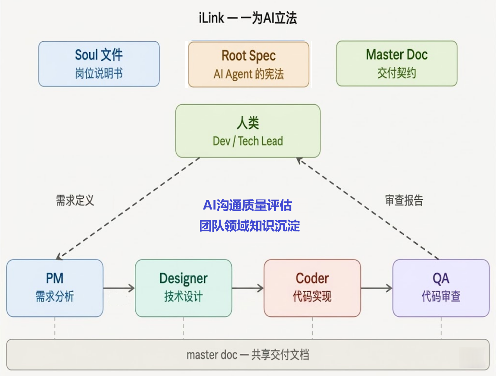

# iLink — AI 分职以成事，团队借智以明道

**CLI-native 的 AI 多角色软件开发协作框架**

## 设计理念

> **iLink — 一为 AI 立法**

<div align="center">
  
</div>

iLink 用 **Root Spec**（AI Agent 的宪法）+ **Soul 文件**（角色岗位说明书）+ **Master Doc**（交付契约），将单一 AI 拆分为多个职责清晰的角色，通过文件状态机驱动端到端协作。三条工作线并行：**交付线**让 AI 像专业团队一样完成需求；**认知线**让 AI 帮团队沉淀领域知识；**协作复盘线**（v1.6.0）让 AI 帮团队反思协作姿势。

### 三条工作线

```
── 交付模式 ──────────────────────────────────────────────────────────
人类写需求 → AI 分析需求 → AI 技术设计 → ⛔人类审核 → AI 编码 → AI 审查 → 人类提交
               PM            Designer    Human-Gate    Coder       QA

── 认知模式 ──────────────────────────────────────────────────────────
资深工程师选定模块 → AI 读源码提炼 → 生成领域知识文档 → 资深审核确认 → 沉淀认知资产
                      Domain Engineer                     Human-Gate

── 协作复盘模式 ──────────────────────────────────────────────────────
ilink-approve 触发 → Coach 子上下文评估对话 + design 编辑 → 追加 feedback.md → 人类回看
                       (fresh context, 不读 master doc, 反献媚反美化)
```

### 解决的核心问题

当前主流 AI 编程工具（Copilot、Cursor、Claude Code 等）都是**"一个 AI 做所有事"**的模式，带来三个结构性问题：

| 问题 | 表现 | iLink 的解决方式 |
|------|------|-----------------|
| **上下文膨胀** | 任务复杂时 AI 的上下文越来越长，质量下降 | 每个角色只读取自己需要的上游文档，Context 精简 |
| **自我合理化** | AI 自审代码容易"看着都对"，难以发现自身错误 | 下游角色天然审查上游产出，链式交叉审查 |
| **控制粒度粗** | 只能全程手动或全程放手，缺少中间态 | Human-Gate 机制，人类可在任意节点精确介入 |

## 核心特性

- **角色分工流水线**：PM → Designer → Coder → QA，每个角色职责清晰、互不越权
- **文件状态机**：所有状态保存在 Markdown 文件中，不依赖内存，支持断点续跑和跨机器接力
- **Human-Gate**：设计阶段默认需要人类审核，审核通过后才能编码。团队建立信任后可逐步放开
- **QA 回流 + 熔断**：代码审查不通过时自动回流修复，连续 3 次不过强制熔断，要求人类介入
- **STAGING 修订**：AI 遇到不确定项时标记 `[待确认]` 并暂停，人类通过 `ilink-refine` 逐条确认，决策记录为 `[已确认]`
- **Story 隔离**：每个需求一个独立目录，完整文档链，互不干扰，天然适配 Jira/工单驱动的迭代开发
- **Metadata 印章**：每份文档记录角色、AI 模型、时间戳、上游文档 SHA1 哈希，构成可追溯的决策链
- **模型无关**：核心资产全部是纯 Markdown，不绑定特定 LLM。Claude、GPT、Qwen 均可使用
- **多平台支持**：同一套协议可运行在 Claude CLI、Qoder CLI、Codex CLI、Gemini CLI 等不同 Host CLI 上
- **Domain Knowledge（领域知识）**：认知模式下 AI 读取既有源码，生成 10 章标准领域知识文档——业务定位、业务实体、流程全景、接口与集成、内部机制、业务规则、设计决策、配置参数、故障模式、待确认，由资深工程师引导，沉淀为团队认知资产。其中 §4「接口与集成」由 AI 通过 grep `@BexMethod` / `@Autowired` / `@DataSource` / `@Value` 等注解机械提取，输出对外功能号 / 内部依赖 / 数据库依赖 / 配置依赖四张依赖表，是代码事实驱动、非推测的依赖全景视图——新成员接手、影响面分析、改造前盘点都靠这一章
- **Coach 协作复盘（v1.6.0）**：每次 `ilink-approve` 触发独立子上下文中的 Coach，原文摘录人类对话 + 计算 design 直接编辑 diff，输出一段反献媚、反自我美化、必须带证据的反馈，追加到 `<story>-feedback.md`。Coach 子流程不读 master doc，下游 AI 也不读 feedback.md——它是写给人类看的协作镜子，异常时不阻塞 Status 推进
- **Per-Story Usage 追踪（v1.6.0）**：`/ilink-init` 与 `/ilink-qa` 强制要求第二参数 `<usage-value>`——执行命令前先用平台原生命令查"已用量"（Claude `/usage` %、Qoder `/usage` credits、Codex `/status` tokens、Gemini `/stats` tokens）并传入。结果写入独立的 `<story>-usage.md`，自动计算 Latest Delta，识别跨 reset 边界。仅采样 init 与 review 两个时点，中间阶段零侵入；usage 文件不参与契约链，缺失或写入失败均不阻塞 Status 推进
- **CLI-native**：不自建 LLM 调用层，充分利用 Host CLI 的原生能力

## 快速开始

### 前置条件

- 一个已有的项目（任何语言、任何框架）
- 已安装至少一个支持的 Host CLI（Claude CLI / Qoder CLI / Codex CLI / Gemini CLI）

### 第一步：复制 iLink 到你的项目

```bash
# 将 iLink 框架文件复制到项目根目录
cp -r iLink/ <your-project>/iLink/

# 根据你使用的 CLI，复制对应的 commands 目录
# Claude CLI 用户：
cp -r .claude/ <your-project>/.claude/

# Qoder CLI 用户：
cp -r .qoder/ <your-project>/.qoder/

# Codex CLI 用户：
cp -r .codex/ <your-project>/.codex/

# Gemini CLI 用户：
cp -r .gemini/ <your-project>/.gemini/
```

### 第二步：项目冷启动（一次性）

```bash
# AI 分析项目 → 生成 project-context.md → 更新入口文件
/ilink-bootstrap
```

Bootstrap 会自动：
1. 分析项目的技术栈、模块结构、构建命令
2. 生成 `project-context.md`（项目知识库）
3. 配置入口文件（`CLAUDE.md` / `AGENTS.md`）

> **可选：环境初始化脚本** `bash iLink/setup.sh`
>
> 这一步**不是必需的**——`/ilink-bootstrap` 不依赖它，直接跑 bootstrap 就能用 iLink。
>
> 这个脚本只做四件辅助事：
> 1. 给 `.claude/commands/`、`.codex/commands/`、`.qoder/commands/`、`.gemini/commands/` 下的 bash 脚本加可执行权限
> 2. 修复 Windows 拷贝可能带来的 CRLF 换行符
> 3. 检查 `bash / awk / sed / grep / curl / od / shasum` 等基础命令是否齐备（Windows Git Bash / macOS / Linux 一般默认全有）
> 4. 给 Codex CLI 用户的 `AGENTS.md` 追加一段 iLink 引导
>
> **谁需要跑**：从其他机器 zip/scp 复制 iLink 目录、或拷贝后发现 `.qoder` / `.codex` 下的 bash 命令"没有执行权限"的用户。
>
> **Windows 用户**：在 Git Bash 里跑 `bash iLink/setup.sh` 即可——chmod 在 Git Bash 下也有效。跳过不跑也行，Claude / Gemini 的 slash command 完全不依赖 exec 权限。

### 第三步：日常开发

```bash
# 创建 Story（v1.6.0：第二参数为当前 session/月度已用量，先用 /usage 或 /stats 查询）
/ilink-init kcia-1520 1200

# 可选：从 Issue 系统自动拉取需求"描述"到 requirement.md（v1.7.0 新增）
# 仅当 project-context.md 顶部"Issue System 集成"块已配置且 project_name 已填写
/ilink-pull kcia-1520

# 编辑需求定义（其余字段仍需手写：范围/验收标准/约束等）
# 打开 iLink-doc/kcia-1520/kcia-1520-requirement.md

# 启动 AI 流水线（中间阶段不需要 usage 参数）
/ilink-pm kcia-1520          # AI 需求分析 → 输出业务合同
# 如果 PM 输出 STAGING（存在 [待确认] 项），先修订再继续
/ilink-refine kcia-1520      # 逐条确认 → 继续流水线
/ilink-design kcia-1520      # AI 技术设计 → 输出文件清单

# 你审核设计（最重要的审核点）
ilink-approve kcia-1520      # 审核通过后推进 + Coach 协作复盘（v1.6.0）

# AI 编码 + AI 审查（v1.6.0：qa 第二参数同样为当前已用量）
/ilink-coder kcia-1520       # AI 按设计写代码，直接写入磁盘
/ilink-qa kcia-1520 1850     # AI 审查代码，输出审查报告 + usage delta

# 你最终确认后提交
git add iLink-doc/kcia-1520/ src/
git commit -m "kcia-1520: 功能描述（iLink 交付）"
```

## 架构概览

### 系统层次

```
┌──────────────────────────────────────────┐
│       人类（Dev / Tech Lead）              │
│  /ilink-init → /ilink-pm → /ilink-design │
│  → ilink-approve → /ilink-coder → /qa    │
│  /ilink-refine（STAGING 时使用）           │
└──────────────┬───────────────────────────┘
               │ 手动触发
┌──────────────▼───────────────────────────┐
│    Host CLI（Claude / Qoder / Codex / Gemini）   │
│  原生能力：LLM 调用、代码搜索、文件读写     │
├──────────────────────────────────────────┤
│    Slash Command 层（声明式 Markdown）      │
│  /ilink-pm  /ilink-design  /ilink-coder   │
│  /ilink-qa  /ilink-refine                 │
├──────────────────────────────────────────┤
│    Bash 辅助脚本层（轻量）                  │
│  ilink-init / ilink-status / ilink-approve │
│  _common.sh（Metadata 注入、回流计数）      │
└──────────────────────────────────────────┘
```

### 流水线状态流转

```
requirement.md（人类编写）
    │ /ilink-pm
    ▼
pm.master.md [PENDING_DESIGNER | STAGING]
    │                 │ (STAGING 时)
    │                 └──→ /ilink-refine ──→ [PENDING_DESIGNER]
    │ /ilink-design
    ▼
design.master.md [STAGING] ──→ ilink-approve ──→ [PENDING_CODER]
    │ /ilink-coder
    ▼
code.master.md + 源码文件 [PENDING_QA]
    │ /ilink-qa
    ▼
review.master.md
├── COMPLETED ──→ 人类审核 → git commit
├── FAIL_BACK_TO_CODER ──→ /ilink-coder（回流修复，≤3 次）
└── STAGING ──→ /ilink-refine → 人类介入
```

### 文档层级

```
Root Spec（根规范，所有 AI 的"宪法"）
    ↓ 派生
Soul 文件（角色规范，"岗位说明书"）
    ↓ 实现
Command 文件（平台实现，"操作手册"）
```

冲突解决：Root Spec > Soul 文件 > Command 文件

## 四个角色

### 交付模式角色

| 角色 | 职责 | 输入 | 输出 |
|------|------|------|------|
| **PM** | 将需求定义转化为结构化的业务合同 | requirement.md | pm.master.md |
| **Designer** | 将业务合同转化为技术设计 + 文件级任务清单 | pm.master.md + 源码 | design.master.md |
| **Coder** | 严格按设计编写代码，直接写入磁盘 | design.master.md + 源码 | 代码文件 + code.master.md |
| **QA** | AI Code Review，对照设计和验收标准审查代码 | code + design + pm + 源码 | review.master.md |

### 认知模式角色

| 角色 | 职责 | 输入 | 输出 |
|------|------|------|------|
| **Domain Engineer** | 读取既有源码，提炼业务实体、流程全景、内部机制、业务规则、设计决策、故障模式；其中 §4「接口与集成」由 grep 注解机械提取对外功能号 / 内部依赖 / 数据库依赖 / 配置依赖四张表，给出代码事实驱动的依赖全景 | 既有源码 | domain-knowledge.md |

### 协作复盘角色（v1.6.0）

| 角色 | 职责 | 输入 | 输出 |
|------|------|------|------|
| **Coach** | 在 `ilink-approve` 触发的独立子上下文中，仅评估人类沟通输入与 design 直接编辑的协作质量；不读 master doc、不评价代码本身；反献媚、反自我美化、必须带 [turn-N] 或 @diff-hunk 证据 | 对话原文摘录 + design 编辑 diff | feedback.md（追加） |

每个角色的行为由对应的 Soul 文件（`iLink/souls/*.soul.md`）定义，所有角色共享 `universal.soul.md` 中的通用行为准则。

## 目录结构

```
<your-project>/
├── project-context.md                  ← 项目知识库（单一事实源）
├── CLAUDE.md / AGENTS.md               ← 入口路由文件（薄路由）
│
├── iLink/                              ← 框架资产（提交到 Git）
│   ├── iLink-root-spec.md                    ← 根规范
│   ├── iLink-implementation-guide.md         ← 实施手册
│   ├── setup.sh                           ← 环境初始化脚本
│   └── souls/                             ← 角色规范
│       ├── universal.soul.md
│       ├── pm.soul.md
│       ├── design.soul.md
│       ├── coder.soul.md
│       ├── qa.soul.md
│       ├── domain.soul.md              ← Domain Engineer（认知模式）
│       └── coach.soul.md               ← Coach 协作复盘（v1.6.0）
│
├── iLink-doc/                          ← 文档产出（提交到 Git）
│   ├── <story-id>/                     ← 交付模式：Story 文档
│   │   ├── <id>-requirement.md             ← 人类编写
│   │   ├── <id>-pm.master.md               ← AI 输出
│   │   ├── <id>-design.master.md           ← AI 输出，人类审核
│   │   ├── <id>-code.master.md             ← AI 输出
│   │   ├── <id>-review.master.md           ← AI 输出
│   │   ├── <id>-feedback.md                ← Coach 输出（v1.6.0，仅人类回看）
│   │   ├── <id>-usage.md                   ← Per-Story 耗用追踪（v1.6.0，init/qa 写入）
│   │   └── .snapshots/                     ← design 快照（v1.6.0，本地用，不提交）
│   └── domain/                         ← 认知模式：领域知识文档
│       └── <module>-domain-knowledge.md  ← AI 生成，资深人员审核
│
├── .claude/commands/                   ← Claude CLI 命令
├── .qoder/commands/                    ← Qoder CLI 命令
├── .codex/commands/                    ← Codex CLI 命令
├── .gemini/commands/                   ← Gemini CLI 命令
└── src/                                ← 你的源代码
```

## 支持的 Host CLI

| Host CLI | 命令目录 | 触发方式 |
|----------|---------|---------|
| **Claude CLI** | `.claude/commands/*.md` | `/ilink-pm <story>` |
| **Qoder CLI** | `.qoder/commands/*` | `/ilink-pm <story>` |
| **Codex CLI** | `.codex/commands/*` | 对话中输入 `ilink-pm <story>` |
| **Gemini CLI** | `.gemini/commands/*.toml` | `/ilink-pm <story>` |

同一个项目中，不同开发者可以使用不同的 CLI 工具——Master Doc 格式统一，跨平台无缝接力。

## 命令速查

| 命令 | 用途 | 频率 |
|------|------|------|
| `/ilink-bootstrap` | 项目冷启动（生成项目知识库） | 每个项目一次 |
| `/ilink-init <story> <usage-value>` | 创建 Story 目录和需求模板 + usage 基线（v1.6.0：usage-value 必填） | 每个需求一次 |
| `/ilink-pull <story>` | 从 Issue 系统拉取需求"描述"字段写入 requirement.md（v1.7.0 新增） | init 后可选 |
| `/ilink-pm <story>` | AI 需求分析 | 每个 Story |
| `/ilink-design <story>` | AI 技术设计 | 每个 Story |
| `ilink-approve <story>` | 人类审核推进 + Coach 协作复盘（v1.6.0） | 审核通过后 |
| `/ilink-coder <story>` | AI 编码 | 设计通过后 |
| `/ilink-refine <story>` | 人类逐条确认 `[待确认]` 项 | STAGING 时 |
| `/ilink-qa <story> <usage-value>` | AI 代码审查 + usage delta（v1.6.0：usage-value 必填） | 编码完成后 |
| `ilink-status [story]` | 查看流水线状态 | 随时 |
| `/ilink-domain <module>` | 认知模式：AI 读源码 → 生成领域知识文档 | 资深工程师按需触发 |

> `/ilink-*` 是 AI 执行的 Slash Command，`ilink-*`（无斜杠）是 Shell 脚本。
>
> **v1.6.0 usage-value**：传入"当前 session/月度已用量"的整数。各平台原生命令：Claude `/usage`、Qoder `/usage`、Codex `/status`、Gemini `/stats`。允许传 `0` 表示故意跳过（对应 delta 标注为"不可信"）。详见 [Human Guide §3.8](doc/iLink-human-guide.md)。

## 与 OpenSpec / OhMyOpenCode 的关系

**iLink 不是替代品，而是可叠加的协作增强层。**

| 维度 | OpenSpec | OhMyOpenCode | iLink |
|------|---------|-------------|-------|
| **核心理念** | 规格驱动开发 | 多智能体并行编排 | 角色分工流水线 |
| **工作粒度** | 单次变更 | 任务分解 | Story（需求单元） |
| **擅长场景** | 维护系统规格 | 快速探索、并行执行 | Jira 驱动迭代、合规审计 |
| **审查方式** | 规格 diff + 人工确认 | 智能体间协调 | 链式审查 + Human-Gate |
| **状态持久化** | spec 文件 | 内存/临时 | Master Doc 文件 |
| **审计追溯** | 通过 spec 历史 | 较弱 | Metadata 印章 + 文档链 |

### 叠加使用

iLink 可以与上述方案共存，为其提供补充能力：

- **Story 隔离**：为每个变更提供独立目录和完整追溯
- **角色流水线**：补充顺序审查链，弥补并行模式的质量控制缺口
- **Human-Gate**：增加关键节点的人类审核控制点
- **Metadata 印章**：让产出可追溯、可审计

### 非侵入性设计

- 所有 iLink 文件位于 `iLink/` 和 `iLink-doc/` 目录，与源码隔离
- 不修改源码、不修改构建配置
- 随时移除 `iLink/` 目录，零残留

## 适用场景

**推荐使用 iLink 的场景**：
- Jira/工单驱动的迭代开发
- 金融、政务等合规敏感领域（需要决策审计链）
- Legacy 系统维护（强约束技术栈、隐式架构规则多）
- 多人协作的中大型项目

**直接对话可能更合适的场景**：
- 快速探索和原型开发
- 简单的 bug 修复
- 一次性脚本编写

**两种模式可以共存**：走 iLink 流水线做正式需求，直接对话做日常修复。

## 文档导航

| 文档 | 内容 | 适合谁 |
|------|------|-------|
| [Root Spec](src/iLink/iLink-root-spec.md) | 核心协议规范（状态机、角色契约、字段语义） | 想深入了解协议的人 |
| [Implementation Guide](src/iLink/iLink-implementation-guide.md) | Bootstrap 协议、脚手架规范、推荐执行顺序 | 项目管理者、初次部署的人 |
| [Human Guide](doc/iLink-human-guide.md) | 日常使用实操手册（写需求、审设计、处理回流） | 所有开发者 |
| [Intro (简介)](doc/iLink-intro.md) | 面向团队的介绍材料 | 评估是否引入 iLink 的人 |
| [AI Perspective](doc/iLink-ai-perspective.md) | AI 视角解读协议设计 | AI 从业者、技术决策者 |

## 设计原则

1. **CLI-native**：不自建 LLM 调用层，利用 Host CLI 的原生能力
2. **文件状态机**：所有状态保存在文件中，不依赖内存
3. **模型无关**：纯 Markdown，不绑定特定 LLM
4. **平台可移植**：Soul 文件和 Master Doc 格式跨平台一致
5. **最小自研**：只在 Host CLI 无法覆盖的地方写 bash 脚本
6. **薄路由 + 单一事实源**：入口文件只做路由，项目知识集中在 `project-context.md`
7. **认知与交付分离**：领域知识沉淀（认知模式）与工单开发（交付模式）是独立工作线，互不阻塞，各有其触发条件和产出形式

## 接入成本

| 项目 | 成本 |
|------|------|
| 安装额外软件 | **零**（用现有的 CLI 工具） |
| 修改现有代码 | **零** |
| 修改构建配置 | **零** |
| 执行 Bootstrap | 一次，约 5 分钟 |
| 日常使用 | 记住 10 个命令 |
| 移除 | 删掉 `iLink/` 和 `iLink-doc/`，零残留 |

## 版本

当前版本：**v1.7.0**（正式版）

- Root Spec: `iLink-root-spec.md`
- Implementation Guide: `iLink-implementation-guide.md`

### v1.7.0 变更

本版本聚焦"认知模式精炼 + 外部 Issue 系统打通"，共三项变更：

- **移除 `ilink-sdd` 命令与 SDD Assessment 角色**：v1.4.11 引入的"SDD 适配度评估"经实战发现使用频率低、与 Domain Knowledge 主线重叠；本版本完整移除——删除 6 个文件（4 平台 `ilink-sdd*` + `sdd.soul.md` + 元文档），所有 root-spec / impl-guide / bootstrap / codex-commands.md 中的相关章节与引用一并清理
- **Domain Knowledge 章节重构：去 §9 见贤思齐，新增 §4 接口与集成**：原 §9「见贤思齐」（AI 对标国际产品的主观评级）易陷入推测；改为新 §4「接口与集成」——由 grep 注解（`@BexMethod` / `@Autowired` / `@DataSource` / `@Value`）**机械提取**对外功能号 / 内部依赖 / 数据库依赖 / 配置依赖四张依赖表，是代码事实驱动、不会与代码漂移的依赖全景视图。原 §4-§8 顺移到 §5-§9
- **新增 `/ilink-pull` 命令**：从外部 Issue 系统（类 Jira，金证内网 KDOP）按 story-id 拉取需求"描述"字段，写入 `<story>-requirement.md` 的"## 功能描述"区块。bash 实现，纯 grep + curl + awk + od，零新依赖（Windows Git Bash / macOS / Linux 默认全有）。配置存于 `project-context.md` 顶部的"Issue System 集成"AI 隔离块。四个平台（Claude / Qoder / Codex / Gemini）完全独立实现

### v1.6.0 新增

- **Coach 角色**：新增 `iLink/souls/coach.soul.md`，定义协作复盘子流程的行为规范（6+4 评估维度、4 条输出纪律、反献媚反自我美化原则）
- **`ilink-approve` 升级为 Slash Command**：内部串行执行"校验前置 → 调用 Coach 子流程 → 写入 feedback.md → 推进 Status"，Coach 子流程在独立 fresh-context 中运行，仅看对话摘录 + design 编辑 diff，不读任何 master doc
- **协作反馈文件**：`iLink-doc/<story>/<story>-feedback.md`——单文件、追加写入、不带 Metadata、下游 AI 不读取，仅服务于人类协作复盘
- **design 快照机制**：`/ilink-design` 完成后会将 design.master.md 复制到 `iLink-doc/<story>/.snapshots/design.master.<timestamp>.md`，Coach 据此计算人类对 design 的直接编辑 diff。`.snapshots/` 目录 MUST 加入 `.gitignore`
- **Coach 异常不阻塞**：子流程失败或返回为空时，会在 feedback.md 追加异常说明，但 Status 推进照常进行——协作复盘是增强项，不是熔断点
- **Per-Story Usage 追踪硬接口**：`/ilink-init` 与 `/ilink-qa` 强制要求第二参数 `<usage-value>`。结果写入 `iLink-doc/<story>/<story>-usage.md`：单文件、init + review-N 行表格、自动计算 Latest Delta。各平台 Usage_Unit 由命令硬编码（`claude-5h-pct` / `qoder-credits-cumulative` / `codex-session-tokens` / `gemini-session-tokens`），不接受用户输入。usage 文件不挂 Metadata 印章、不参与契约链，缺失或写入失败 SHALL NOT 阻塞 Status 推进——它只为人类提供事后观察。详细协议见 Root Spec §8.1.2

### v1.5.0 破坏性变更

- 需求定义文件名英文化：`<story>-需求定义.md` → `<story>-requirement.md`，统一使用英文文件名
- v1.5.0 起框架不再识别旧文件名，已有的 Story 需手动改名：

  ```bash
  mv iLink-doc/<story>/<story>-需求定义.md iLink-doc/<story>/<story>-requirement.md
  ```

## 作者

周本高

## 许可证

[Apache-2.0 license]
